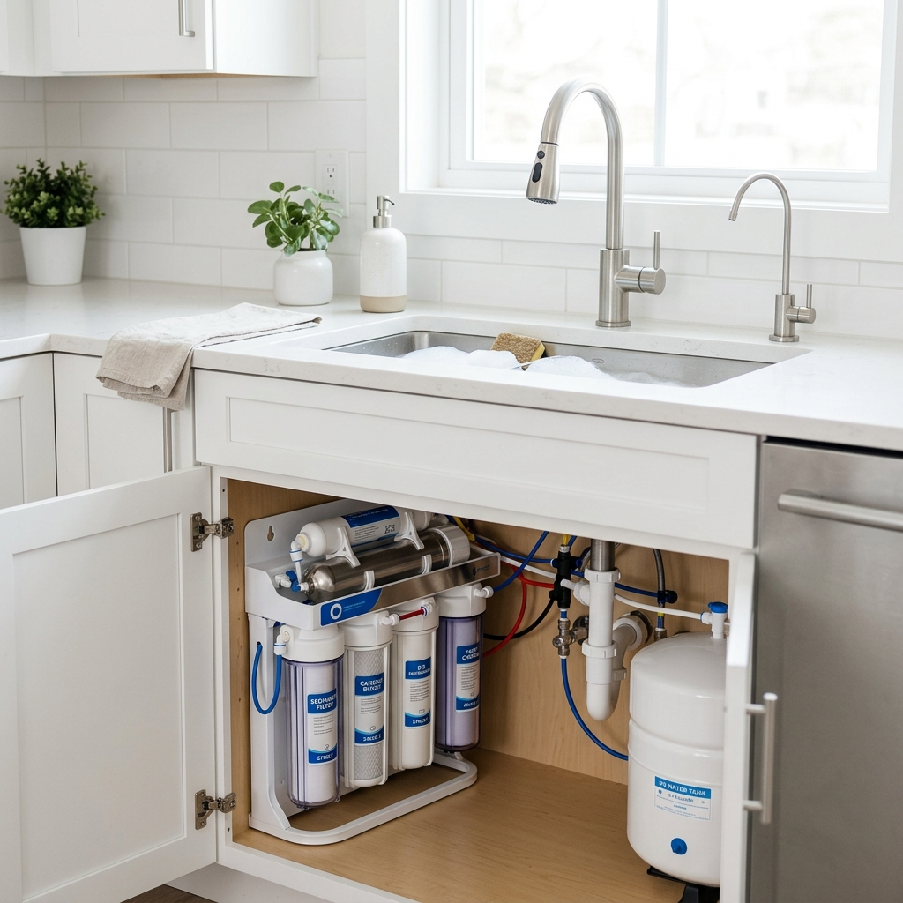

# مدار لتكنولوجيا المياه — Landing Page

> High-conversion Arabic landing page for **Madar Water Technology**, a water filter sales & maintenance company serving Amman, Jordan.



## ✨ Features

- **RTL Arabic layout** — fully right-to-left with Cairo font
- **Mobile-first responsive** — optimized for all screen sizes
- **SEO optimized** — JSON-LD structured data, Open Graph, Twitter Cards, sitemap, robots.txt
- **Conversion focused** — WhatsApp + phone call CTAs throughout the page
- **Smooth animations** — scroll reveals, floating cards, wave dividers, water bubbles
- **Accessibility** — skip-to-content link, ARIA labels, `prefers-reduced-motion` support
- **Production ready** — Vercel deployment config with caching & security headers

## 📂 Project Structure

```
├── index.html          # Main landing page (SEO-optimized)
├── css/
│   └── styles.css      # Design system & responsive styles
├── js/
│   └── main.js         # Contact wiring, scroll effects, animations
├── images/
│   ├── hero.webp       # Hero section image
│   ├── filter-5-stage.webp
│   ├── filter-7-stage.webp
│   ├── filter-ro.webp
│   └── filter-central.webp
├── robots.txt          # Search engine crawler rules
├── sitemap.xml         # XML sitemap for Google indexing
├── vercel.json         # Vercel deployment configuration
└── README.md
```

## 🚀 Deploy to Vercel

### One-click deploy

[](https://vercel.com/new/clone?repository-url=https://github.com/YOUR_USERNAME/water-filter-landing-page)

### Manual deploy

```bash
# Install Vercel CLI
npm i -g vercel

# Deploy
vercel --prod
```

No build step required — this is a static site that deploys instantly.

## ⚙️ Configuration

Edit the contact info in `js/main.js`:

```javascript
const CONTACT = {
  phone: "+962791122511",
  whatsapp: "962792810675",
  waMsg: "مرحباً، أود الاستفسار عن فلاتر المياه — مدار لتكنولوجيا المياه"
};
```

All CTA buttons across the page update automatically from this single config.

## 🔍 SEO

- **Target keywords**: فلاتر مياه عمان, فلاتر مياه الأردن, تركيب فلاتر مياه, صيانة فلاتر المياه, فلتر 5 مراحل, فلتر 7 مراحل, فلتر RO, فلتر مركزي
- **Structured data**: LocalBusiness JSON-LD schema
- **Meta tags**: Title, description, Open Graph, Twitter Card, canonical URL

> **Note**: After deployment, update the canonical URL in `index.html`, `sitemap.xml`, and `robots.txt` to match your production domain.

## 📱 Responsive Breakpoints

| Breakpoint | Layout |
|------------|--------|
| < 600px | Mobile — stacked layout, repositioned float cards |
| < 760px | Header CTA hidden, nav links hidden |
| < 900px | Products grid: 2 columns |
| < 960px | Hero: single column (stacked) |
| ≥ 960px | Full desktop layout |

## 🛠️ Tech Stack

- **HTML5** — semantic markup
- **CSS3** — custom properties, clamp(), grid, flexbox
- **Vanilla JS** — zero dependencies
- **Google Fonts** — Cairo (Arabic)
- **SVG icons** — inline, no external dependencies

## 📄 License

© 2026 مدار لتكنولوجيا المياه — All rights reserved.
